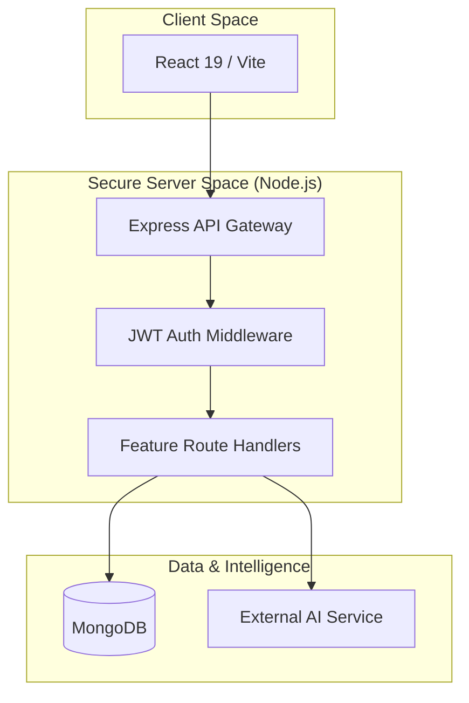
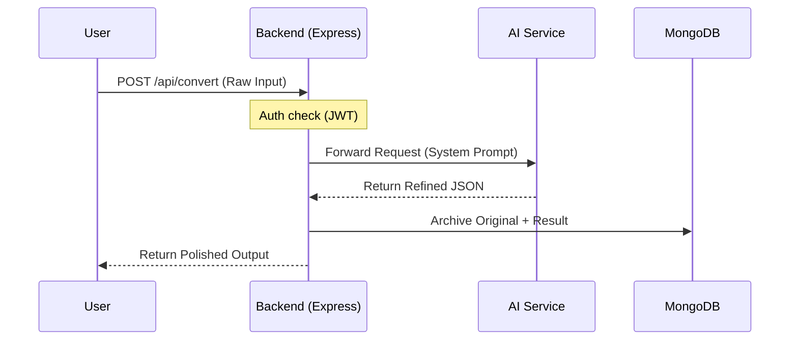
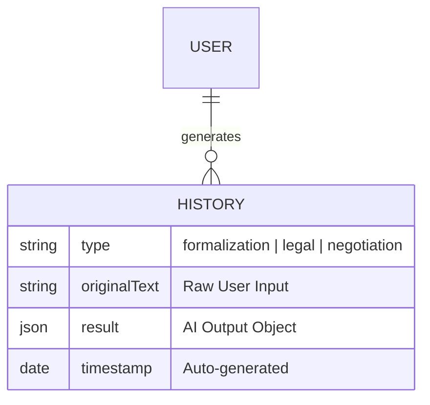
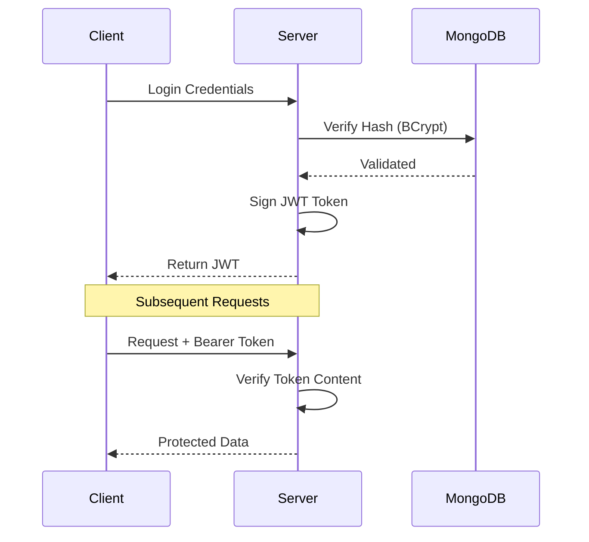
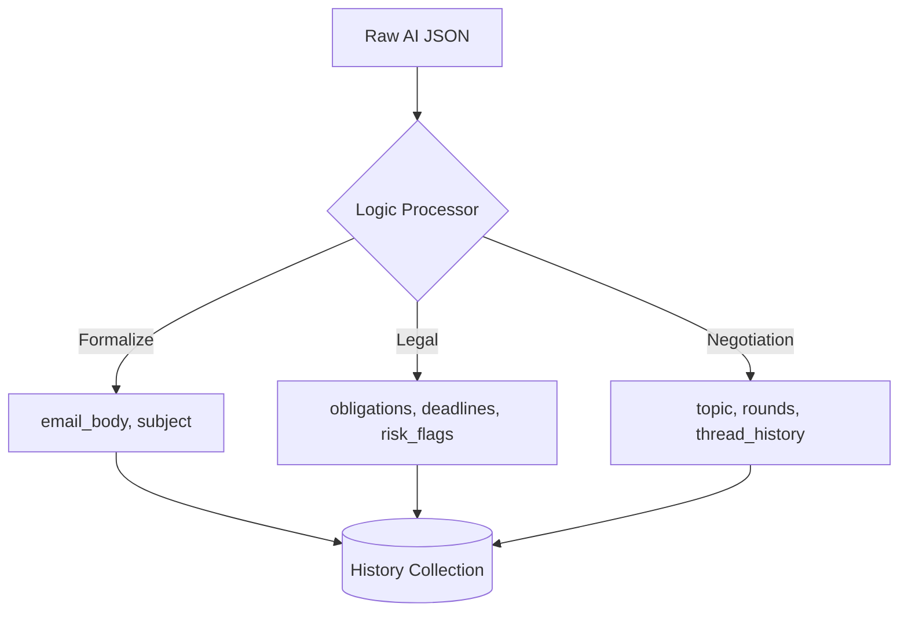

# ToneForge Backend: Presentation Guide

This guide provides slide-by-slide content, diagrams, and talking points specifically designed for a technical presentation of the backend architecture.

---

## Slide 1: Backend Architecture Overview
**Goal**: Explain the high-level MERN stack relationship and the "Proxy" concept.

### Visual: System Block Diagram


### Key Points:
*   **Decoupled Architecture**: Separation of concerns between the dynamic UI and the heavy-duty processing logic.
*   **Secure Proxy Pattern**: All AI requests are routed through Node.js to hide sensitive API keys and standardize responses.
*   **Centralized Middleware**: Authentication and logging are handled at the gateway level.

---

## Slide 1.5: API Routing & Connectivity
**Goal**: Detail the internal routing structure of the Express application.

### Visual: API Route Map
```mermaid
graph LR
    Root[/api] --> Auth[/auth]
    Root --> History[/history]
    Root --> Users[/users]
    Root --> Core[/convert]
    Root --> Legal[/parse_legal]
    Root --> Neg[/negotiate]

    subgraph Auth_Routes
        Auth --> Login[POST /login]
        Auth --> Signup[POST /signup]
    end

    subgraph Feature_Routes
        Core --> Formal[POST /]
        Legal --> Parse[POST /]
        Neg --> Sim[POST /]
    end
```

### Talking Points:
*   **Modular Routing**: Using `express.Router()` for clean, maintainable separation of features.
*   **Endpoint Predictability**: Standard REST patterns applied across all services.

---

## Slide 2: Request Lifecycle (The "Forge" Process)
**Goal**: Describe what happens when a user clicks "Analyze".

### Visual: Sequence Diagram


### Talking Points:
*   **Sanitization**: Input is cleaned before being sent to external models.
*   **System Prompting**: The backend injects specific instructions (tones) to guide the AI behavior.
*   **Automatic Archiving**: History is saved instantly upon success, ensuring no data loss.

---

## Slide 3: Database & Persistence
**Goal**: Show how unstructured AI data is structured in MongoDB.

### Visual: Schema Relationship


### Key Points:
*   **NoSQL Flexibility**: Using MongoDB allows us to store varying AI response shapes (emails vs. legal clauses) in a single collection.
*   **User Attribution**: Every history entry is strictly linked to a `userId` via Mongoose object references.
*   **Metadata Richness**: We store category, language, and original text to allow for future "Re-forging" or analytics.

---

## Slide 4: Security & Auth Flow
**Goal**: Technical justification of the security choices.

### Visual: Authentication Handshake


### Talking Points:
1.  **Stateless Authentication**: Using **JWT (JSON Web Tokens)** avoids server-side session overhead.
2.  **Password Hashing**: BCrypt is used for one-way encryption of user credentials.
3.  **Environment Isolation**: Sensitive host URLs and API keys are stored in `.env`, preventing accidental exposure in the client-side code.
4.  **Error Masking**: Backend catch-blocks ensure that internal server errors don't expose stack traces to the end user.

---

## Slide 4.5: Feature-Specific Data Flow (Legal/Negotiation)
**Goal**: Show how different AI results are mapped to the History model.

### Visual: Data Transformation Map


---

## Slide 5: API Endpoints (The Core Engine)
**Goal**: Quick overview of the available services.

| Endpoint | Logic | Data Type |
| :--- | :--- | :--- |
| `/api/auth` | User lifecycle management | JWT/Bcrypt |
| `/api/convert` | Tone-specific email refinement | Structural JSON |
| `/api/parse_legal` | Critical clause & risk extraction | Object Array |
| `/api/negotiate` | Multi-round strategic simulation | Thread/History |
| `/api/history` | Personalized user activity feed | MongoDB Query |

---

## Slide 6: Summary of Backend Innovation
*   **High Performance**: Low-latency Node.js handling asynchronous AI streams.
*   **Reliability**: Centralized error handling for 3rd party service failures.
*   **Clean API**: Minimalist REST endpoints that are easy for any frontend to consume.
