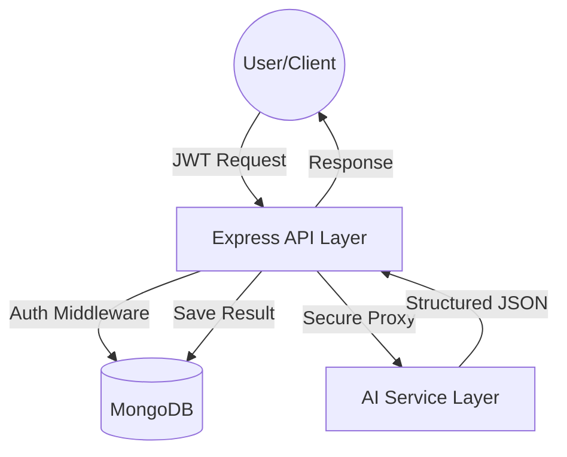
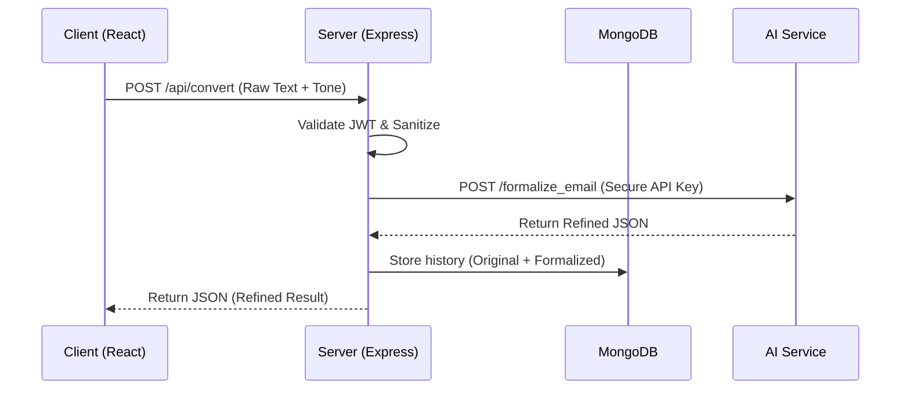
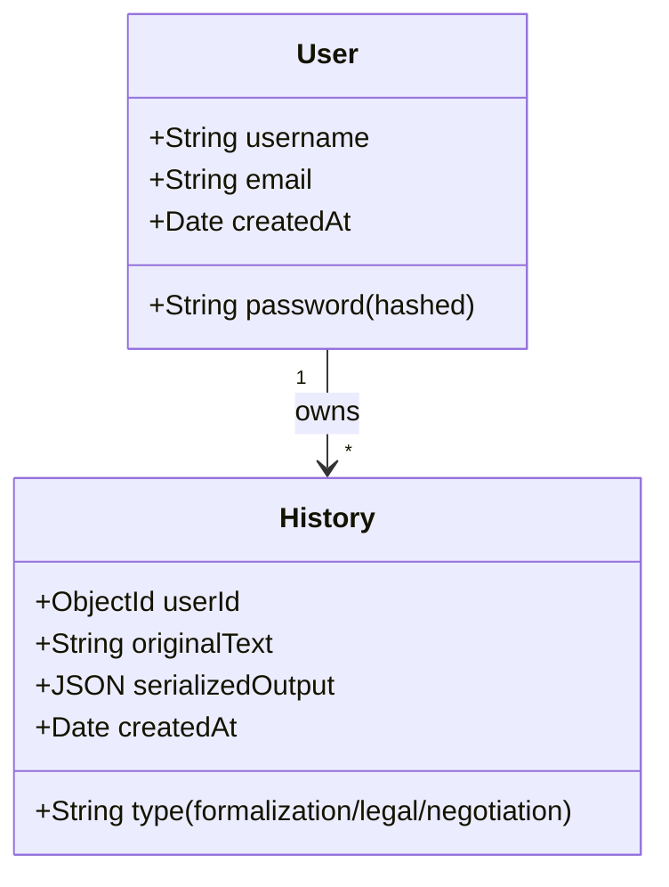

# ToneForge: Backend Architecture & Visuals

This document visualizes the core backend architecture and data flow of the ToneForge system, focusing on secure AI proxying and persistent storage.

## 1. System Architecture Overview

ToneForge follows a decoupled architecture where the Node.js backend acts as a secure intermediary between the user and AI services.

---

## 2. API Data Flow

The following diagram illustrates the lifecycle of a request from the initial input to the final refined output.

---

## 3. Database Schema Visualization

The system uses a flexible MERN-stack schema to record all interactions and analytical data.

---

## 4. Security & Integration Layer

- **JWT Middleware**: Every request is intercepted to verify the user's session authenticity.
- **Environment Isolation**: API keys and service URLs are managed via `.env` files, never exposed to the client.
- **Data Normalization**: The backend ensures that regardless of the AI model used, the frontend receives a consistent JSON structure.
